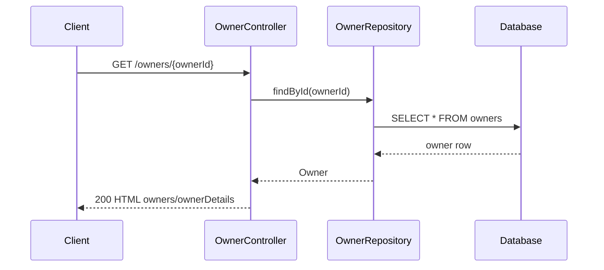
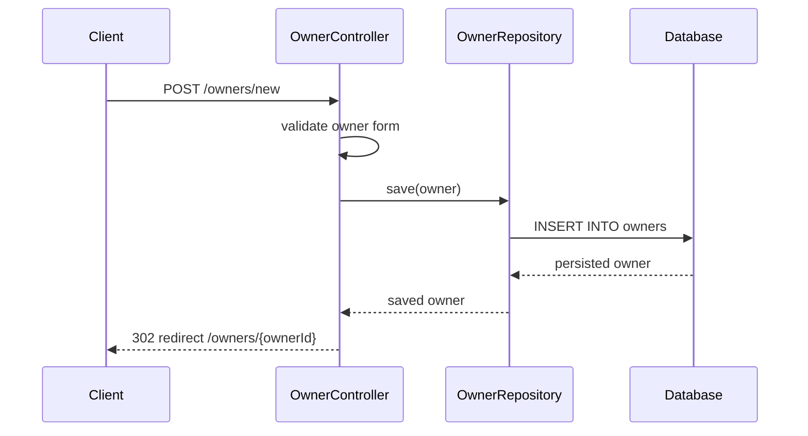
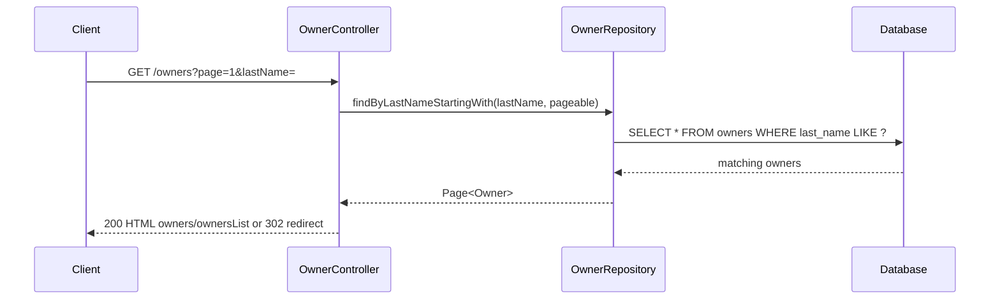
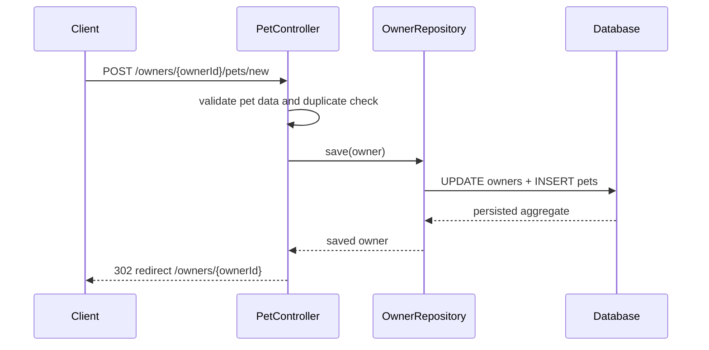
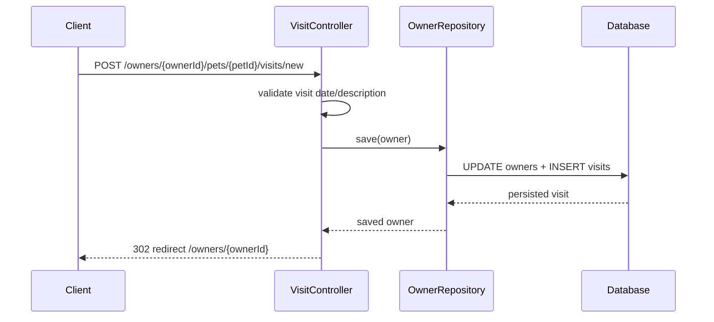

# Service Analysis Document — Spring PetClinic Customer Domain

---

## 1. Overview

- **Service Name:** spring-petclinic-customers-service
- **Scope of this analysis:** whole service
- **Purpose:** This repository does not contain a standalone `spring-petclinic-customers-service` module. The closest equivalent customer/owner domain is the owner-management flow in `org.springframework.samples.petclinic.owner`, which owns owner, pet, and visit records for the clinic and exposes MVC endpoints for creating, searching, updating, and reviewing customer records.
- **Technology Stack:** Java 17, Spring Boot, Spring MVC, Spring Data JPA, Thymeleaf, Jakarta Validation, H2/MySQL/PostgreSQL relational databases
- **Repository Path:** `src/main/java/org/springframework/samples/petclinic/owner`
- **Owner / Team:** _Not found in codebase — confirm with team_
- **Last Analysed:** 260814

---

## 2. Endpoints / Methods in Scope

### 2.1 GET /owners/new — Create owner form

| Field | Detail |
|---|---|
| **Method** | GET |
| **Path / Topic / Signature** | `/owners/new` |
| **Description** | Returns the owner creation form view. |
| **Auth / Access Control** | Public (no explicit security configuration is present in this code path). |
| **Rate Limiting** | _Not found in codebase — confirm with team_ |

**Request Payload / Method Inputs**

```json
{
  "owner": "Owner — form-bound object — optional"
}
```

**Response Payloads / Method Outputs**

| Status | Condition | Body |
|---|---|---|
| 200 | Success | HTML view: `owners/createOrUpdateOwnerForm` |
| 500 | Server error | `{ "error": "Internal server error" }` |

**Dependencies Called by This Target**

| # | Dependency | Type | Endpoint / Method Called | Purpose | Sync / Async |
|---|---|---|---|---|---|
| 1 | `OwnerRepository` | DB | `JpaRepository.save` / read access via model binding | No data access in this specific method; repository is not invoked directly | Sync |

**Special Notes**
- No auth, rate limiting, or retry policy is defined.
- This is a server-rendered MVC view and does not call external services.

### 2.2 POST /owners/new — Create owner

| Field | Detail |
|---|---|
| **Method** | POST |
| **Path / Topic / Signature** | `/owners/new` |
| **Description** | Validates the owner form, persists the owner, and redirects to the newly created owner details page. |
| **Auth / Access Control** | Public |
| **Rate Limiting** | _Not found in codebase — confirm with team_ |

**Request Payload / Method Inputs**

```json
{
  "firstName": "String — required — validated by @NotBlank and @Size",
  "lastName": "String — required — validated by @NotBlank and @Size",
  "address": "String — required — validated by @NotBlank",
  "city": "String — required — validated by @NotBlank",
  "telephone": "String — required — regex ^\\d{10}$"
}
```

**Response Payloads / Method Outputs**

| Status | Condition | Body |
|---|---|---|
| 200 | Validation failure | HTML form re-render |
| 302 | Success | Redirect to `/owners/{ownerId}` |
| 500 | Server error | `{ "error": "Internal server error" }` |

**Dependencies Called by This Target**

| # | Dependency | Type | Endpoint / Method Called | Purpose | Sync / Async |
|---|---|---|---|---|---|
| 1 | `OwnerRepository` | DB | `save(owner)` | Persist newly created owner | Sync |

**Special Notes**
- Validation errors are checked via `BindingResult`.
- No explicit retry/circuit-breaker behaviour is implemented.

### 2.3 GET /owners/find — Search owner form

| Field | Detail |
|---|---|
| **Method** | GET |
| **Path / Topic / Signature** | `/owners/find` |
| **Description** | Shows the owner lookup form. |
| **Auth / Access Control** | Public |
| **Rate Limiting** | _Not found in codebase — confirm with team_ |

**Request Payload / Method Inputs**

```json
{
  "owner": "Owner — optional form model"
}
```

**Response Payloads / Method Outputs**

| Status | Condition | Body |
|---|---|---|
| 200 | Success | HTML view: `owners/findOwners` |
| 500 | Server error | `{ "error": "Internal server error" }` |

**Dependencies Called by This Target**

| # | Dependency | Type | Endpoint / Method Called | Purpose | Sync / Async |
|---|---|---|---|---|---|
| 1 | `OwnerRepository` | DB | `findByLastNameStartingWith` (invoked in next endpoint, not directly here) | Search is performed in `processFindForm` | Sync |

**Special Notes**
- The actual data lookup occurs in the list endpoint, not in the initial form request.

### 2.4 GET /owners — Find owners by last name

| Field | Detail |
|---|---|
| **Method** | GET |
| **Path / Topic / Signature** | `/owners` |
| **Description** | Searches owners by last name, supports pagination, redirects when one match exists, or returns an owner list when multiple matches exist. |
| **Auth / Access Control** | Public |
| **Rate Limiting** | _Not found in codebase — confirm with team_ |

**Request Payload / Method Inputs**

```json
{
  "page": "Integer — optional, default 1",
  "owner.lastName": "String — optional"
}
```

**Response Payloads / Method Outputs**

| Status | Condition | Body |
|---|---|---|
| 302 | One owner found | Redirect to `/owners/{ownerId}` |
| 200 | Multiple owners found | HTML view: `owners/ownersList` with pagination metadata |
| 200 | No owners found | HTML form re-render with validation error |
| 500 | Server error | `{ "error": "Internal server error" }` |

**Dependencies Called by This Target**

| # | Dependency | Type | Endpoint / Method Called | Purpose | Sync / Async |
|---|---|---|---|---|---|
| 1 | `OwnerRepository` | DB | `findByLastNameStartingWith(lastName, pageable)` | Query matching owners by surname | Sync |

**Special Notes**
- Uses `PageRequest.of(page - 1, 5)` with a page size of 5.
- Empty last name means broad search.

### 2.5 GET /owners/{ownerId}/edit — Edit owner form

| Field | Detail |
|---|---|
| **Method** | GET |
| **Path / Topic / Signature** | `/owners/{ownerId}/edit` |
| **Description** | Loads the owner edit form. |
| **Auth / Access Control** | Public |
| **Rate Limiting** | _Not found in codebase — confirm with team_ |

**Request Payload / Method Inputs**

```json
{
  "ownerId": "Integer — path variable — required"
}
```

**Response Payloads / Method Outputs**

| Status | Condition | Body |
|---|---|---|
| 200 | Success | HTML view: `owners/createOrUpdateOwnerForm` |
| 500 | Server error | `{ "error": "Internal server error" }` |

**Dependencies Called by This Target**

| # | Dependency | Type | Endpoint / Method Called | Purpose | Sync / Async |
|---|---|---|---|---|---|
| 1 | `OwnerRepository` | DB | `findById(ownerId)` via `@ModelAttribute("owner")` | Load the owner being edited | Sync |

**Special Notes**
- Data is resolved by the `@ModelAttribute("owner")` method before the form renders.

### 2.6 POST /owners/{ownerId}/edit — Update owner

| Field | Detail |
|---|---|
| **Method** | POST |
| **Path / Topic / Signature** | `/owners/{ownerId}/edit` |
| **Description** | Validates an owner update, checks the ID matches the URL, persists the updated owner, and redirects back to the owner detail page. |
| **Auth / Access Control** | Public |
| **Rate Limiting** | _Not found in codebase — confirm with team_ |

**Request Payload / Method Inputs**

```json
{
  "ownerId": "Integer — path variable — required",
  "id": "Integer — form field — must match ownerId",
  "firstName": "String — required — validated by @NotBlank and @Size",
  "lastName": "String — required — validated by @NotBlank and @Size",
  "address": "String — required — validated by @NotBlank",
  "city": "String — required — validated by @NotBlank",
  "telephone": "String — required — regex ^\\d{10}$"
}
```

**Response Payloads / Method Outputs**

| Status | Condition | Body |
|---|---|---|
| 200 | Validation error | HTML form re-render |
| 302 | Success | Redirect to `/owners/{ownerId}` |
| 500 | Server error | `{ "error": "Internal server error" }` |

**Dependencies Called by This Target**

| # | Dependency | Type | Endpoint / Method Called | Purpose | Sync / Async |
|---|---|---|---|---|---|
| 1 | `OwnerRepository` | DB | `save(owner)` | Persist owner update | Sync |

**Special Notes**
- Explicit mismatch detection prevents URL/body desynchronization.

### 2.7 GET /owners/{ownerId} — Show owner details

| Field | Detail |
|---|---|
| **Method** | GET |
| **Path / Topic / Signature** | `/owners/{ownerId}` |
| **Description** | Loads an owner and renders the owner details page including associated pets and visits. |
| **Auth / Access Control** | Public |
| **Rate Limiting** | _Not found in codebase — confirm with team_ |

**Request Payload / Method Inputs**

```json
{
  "ownerId": "Integer — path variable — required"
}
```

**Response Payloads / Method Outputs**

| Status | Condition | Body |
|---|---|---|
| 200 | Success | HTML view: `owners/ownerDetails` |
| 500 | Owner not found | `IllegalArgumentException` from repository lookup |

**Dependencies Called by This Target**

| # | Dependency | Type | Endpoint / Method Called | Purpose | Sync / Async |
|---|---|---|---|---|---|
| 1 | `OwnerRepository` | DB | `findById(ownerId)` | Retrieve owner record | Sync |

**Special Notes**
- The owner model contains a lazy/eager managed list of pets and the detail view renders aggregate information.

### 2.8 GET /owners/{ownerId}/pets/new — Create pet form

| Field | Detail |
|---|---|
| **Method** | GET |
| **Path / Topic / Signature** | `/owners/{ownerId}/pets/new` |
| **Description** | Prepares the pet creation form and attaches the owning owner to the model. |
| **Auth / Access Control** | Public |
| **Rate Limiting** | _Not found in codebase — confirm with team_ |

**Request Payload / Method Inputs**

```json
{
  "ownerId": "Integer — path variable — required"
}
```

**Response Payloads / Method Outputs**

| Status | Condition | Body |
|---|---|---|
| 200 | Success | HTML view: `pets/createOrUpdatePetForm` |
| 500 | Owner not found | `IllegalArgumentException` |

**Dependencies Called by This Target**

| # | Dependency | Type | Endpoint / Method Called | Purpose | Sync / Async |
|---|---|---|---|---|---|
| 1 | `OwnerRepository` | DB | `findById(ownerId)` | Loads owner to attach to model | Sync |
| 2 | `PetTypeRepository` | DB | `findPetTypes()` | Populates pet type choices | Sync |

**Special Notes**
- `@ModelAttribute("types")` loads valid pet types before the view is rendered.

### 2.9 POST /owners/{ownerId}/pets/new — Create pet

| Field | Detail |
|---|---|
| **Method** | POST |
| **Path / Topic / Signature** | `/owners/{ownerId}/pets/new` |
| **Description** | Validates the pet form, prevents duplicate names, saves the pet to the owner, and redirects back to owner details. |
| **Auth / Access Control** | Public |
| **Rate Limiting** | _Not found in codebase — confirm with team_ |

**Request Payload / Method Inputs**

```json
{
  "ownerId": "Integer — path variable — required",
  "name": "String — required — duplicate check by owner",
  "birthDate": "LocalDate — optional — must not be in the future",
  "type": "PetType — required"
}
```

**Response Payloads / Method Outputs**

| Status | Condition | Body |
|---|---|---|
| 200 | Validation error | HTML form re-render |
| 302 | Success | Redirect to `/owners/{ownerId}` |
| 500 | Server error | `{ "error": "Internal server error" }` |

**Dependencies Called by This Target**

| # | Dependency | Type | Endpoint / Method Called | Purpose | Sync / Async |
|---|---|---|---|---|---|
| 1 | `OwnerRepository` | DB | `save(owner)` | Persist updated owner/pet graph | Sync |

**Special Notes**
- Duplicate pet-name validation is done against `owner.getPet(name, true)`.
- The system saves the full owner aggregate, not just the pet entity.

### 2.10 GET /owners/{ownerId}/pets/{petId}/edit — Update pet form

| Field | Detail |
|---|---|
| **Method** | GET |
| **Path / Topic / Signature** | `/owners/{ownerId}/pets/{petId}/edit` |
| **Description** | Loads the form to edit an existing pet. |
| **Auth / Access Control** | Public |
| **Rate Limiting** | _Not found in codebase — confirm with team_ |

**Request Payload / Method Inputs**

```json
{
  "ownerId": "Integer — path variable — required",
  "petId": "Integer — path variable — required"
}
```

**Response Payloads / Method Outputs**

| Status | Condition | Body |
|---|---|---|
| 200 | Success | HTML view: `pets/createOrUpdatePetForm` |
| 500 | Owner / pet not found | `IllegalArgumentException` |

**Dependencies Called by This Target**

| # | Dependency | Type | Endpoint / Method Called | Purpose | Sync / Async |
|---|---|---|---|---|---|
| 1 | `OwnerRepository` | DB | `findById(ownerId)` | Load owner and pet state for edit screen | Sync |

**Special Notes**
- The pet is retrieved by `owner.getPet(petId)` in the `@ModelAttribute` setup.

### 2.11 POST /owners/{ownerId}/pets/{petId}/edit — Update pet

| Field | Detail |
|---|---|
| **Method** | POST |
| **Path / Topic / Signature** | `/owners/{ownerId}/pets/{petId}/edit` |
| **Description** | Validates a pet update, prevents duplicate names, persists the pet changes, and redirects to owner details. |
| **Auth / Access Control** | Public |
| **Rate Limiting** | _Not found in codebase — confirm with team_ |

**Request Payload / Method Inputs**

```json
{
  "ownerId": "Integer — path variable — required",
  "petId": "Integer — path variable — required",
  "name": "String — optional but validated when present",
  "birthDate": "LocalDate — optional — no future dates",
  "type": "PetType — optional"
}
```

**Response Payloads / Method Outputs**

| Status | Condition | Body |
|---|---|---|
| 200 | Validation error | HTML form re-render |
| 302 | Success | Redirect to `/owners/{ownerId}` |
| 500 | Server error | `{ "error": "Internal server error" }` |

**Dependencies Called by This Target**

| # | Dependency | Type | Endpoint / Method Called | Purpose | Sync / Async |
|---|---|---|---|---|---|
| 1 | `OwnerRepository` | DB | `save(owner)` | Save updated pet data | Sync |

**Special Notes**
- Updates are done in-memory on the aggregate and then saved as a whole owner object.

### 2.12 GET /owners/{ownerId}/pets/{petId}/visits/new — New visit form

| Field | Detail |
|---|---|
| **Method** | GET |
| **Path / Topic / Signature** | `/owners/{ownerId}/pets/{petId}/visits/new` |
| **Description** | Creates a blank visit object for a pet and renders the visit form. |
| **Auth / Access Control** | Public |
| **Rate Limiting** | _Not found in codebase — confirm with team_ |

**Request Payload / Method Inputs**

```json
{
  "ownerId": "Integer — path variable — required",
  "petId": "Integer — path variable — required"
}
```

**Response Payloads / Method Outputs**

| Status | Condition | Body |
|---|---|---|
| 200 | Success | HTML view: `pets/createOrUpdateVisitForm` |
| 500 | Owner or pet not found | `IllegalArgumentException` |

**Dependencies Called by This Target**

| # | Dependency | Type | Endpoint / Method Called | Purpose | Sync / Async |
|---|---|---|---|---|---|
| 1 | `OwnerRepository` | DB | `findById(ownerId)` | Load owner and pet context | Sync |

**Special Notes**
- A call to `pet.addVisit(new Visit())` populates default data before render.

### 2.13 POST /owners/{ownerId}/pets/{petId}/visits/new — Create visit

| Field | Detail |
|---|---|
| **Method** | POST |
| **Path / Topic / Signature** | `/owners/{ownerId}/pets/{petId}/visits/new` |
| **Description** | Validates the visit date, associates the visit with the pet, persists it through the owner aggregate, and redirects to the owner page. |
| **Auth / Access Control** | Public |
| **Rate Limiting** | _Not found in codebase — confirm with team_ |

**Request Payload / Method Inputs**

```json
{
  "ownerId": "Integer — path variable — required",
  "petId": "Integer — path variable — required",
  "date": "LocalDate — required — must be after today",
  "description": "String — required — validated by @NotBlank"
}
```

**Response Payloads / Method Outputs**

| Status | Condition | Body |
|---|---|---|
| 200 | Validation error | HTML form re-render |
| 302 | Success | Redirect to `/owners/{ownerId}` |
| 500 | Server error | `{ "error": "Internal server error" }` |

**Dependencies Called by This Target**

| # | Dependency | Type | Endpoint / Method Called | Purpose | Sync / Async |
|---|---|---|---|---|---|
| 1 | `OwnerRepository` | DB | `save(owner)` | Persist visit under owner aggregate | Sync |

**Special Notes**
- Validation rejects any visit date that is not after `LocalDate.now()`.

---

## 3. Data Models

### 3.1 Owner

| Field | Type | Required | Validation Rules | Description |
|---|---|---|---|---|
| `id` | Integer | Yes | — | Primary identifier |
| `firstName` | String | Yes | `@NotBlank`, `@Size(max=30)` | Owner first name |
| `lastName` | String | Yes | `@NotBlank`, `@Size(max=30)` | Owner last name |
| `address` | String | Yes | `@NotBlank` | Owner street address |
| `city` | String | Yes | `@NotBlank` | Owner city |
| `telephone` | String | Yes | `@NotBlank`, `@Pattern(regexp = "\\d{10}")` | Contact phone number |
| `pets` | List<Pet> | No | — | Associated pets |

### 3.2 Pet

| Field | Type | Required | Validation Rules | Description |
|---|---|---|---|---|
| `id` | Integer | Yes | — | Primary identifier |
| `name` | String | Yes | inherited from `NamedEntity` | Pet name |
| `birthDate` | LocalDate | No | `@DateTimeFormat` | Pet birth date |
| `type` | PetType | No | — | Pet species/category |
| `visits` | Set<Visit> | No | — | Pet visit history |

### 3.3 Visit

| Field | Type | Required | Validation Rules | Description |
|---|---|---|---|---|
| `id` | Integer | Yes | — | Primary identifier |
| `date` | LocalDate | Yes | `@DateTimeFormat`, must be after today in POST flow | Visit date |
| `description` | String | Yes | `@NotBlank` | Reason for the visit |

### 3.4 PetType

| Field | Type | Required | Validation Rules | Description |
|---|---|---|---|---|
| `id` | Integer | Yes | — | Primary identifier |
| `name` | String | Yes | inherited from `NamedEntity` | Pet category, e.g. cat/dog |

---

## 4. Dependency Map (Recursive Tree)

```
Spring PetClinic Customer Domain
├── [sync]  OwnerController  →  GET /owners/new
├── [sync]  OwnerController  →  POST /owners/new
│   └── [sync]  OwnerRepository  →  save(owner)
│       └── [sync]  H2/MySQL/PostgreSQL  →  owners table (EXTERNAL DB)
├── [sync]  OwnerController  →  GET /owners/find
├── [sync]  OwnerController  →  GET /owners
│   └── [sync]  OwnerRepository  →  findByLastNameStartingWith(lastName, pageable)
│       └── [sync]  H2/MySQL/PostgreSQL  →  owners table (EXTERNAL DB)
├── [sync]  OwnerController  →  GET /owners/{ownerId}/edit
│   └── [sync]  OwnerRepository  →  findById(ownerId)
│       └── [sync]  H2/MySQL/PostgreSQL  →  owners table (EXTERNAL DB)
├── [sync]  OwnerController  →  POST /owners/{ownerId}/edit
│   └── [sync]  OwnerRepository  →  save(owner)
│       └── [sync]  H2/MySQL/PostgreSQL  →  owners table (EXTERNAL DB)
├── [sync]  OwnerController  →  GET /owners/{ownerId}
│   └── [sync]  OwnerRepository  →  findById(ownerId)
│       └── [sync]  H2/MySQL/PostgreSQL  →  owners table (EXTERNAL DB)
├── [sync]  PetController  →  GET /owners/{ownerId}/pets/new
│   ├── [sync]  OwnerRepository  →  findById(ownerId)
│   │   └── [sync]  H2/MySQL/PostgreSQL  →  owners table (EXTERNAL DB)
│   └── [sync]  PetTypeRepository  →  findPetTypes()
│       └── [sync]  H2/MySQL/PostgreSQL  →  types table (EXTERNAL DB)
├── [sync]  PetController  →  POST /owners/{ownerId}/pets/new
│   └── [sync]  OwnerRepository  →  save(owner)
│       └── [sync]  H2/MySQL/PostgreSQL  →  owners + pets tables (EXTERNAL DB)
├── [sync]  PetController  →  GET /owners/{ownerId}/pets/{petId}/edit
│   └── [sync]  OwnerRepository  →  findById(ownerId)
│       └── [sync]  H2/MySQL/PostgreSQL  →  owners table (EXTERNAL DB)
├── [sync]  PetController  →  POST /owners/{ownerId}/pets/{petId}/edit
│   └── [sync]  OwnerRepository  →  save(owner)
│       └── [sync]  H2/MySQL/PostgreSQL  →  owners + pets tables (EXTERNAL DB)
├── [sync]  VisitController  →  GET /owners/{ownerId}/pets/{petId}/visits/new
│   └── [sync]  OwnerRepository  →  findById(ownerId)
│       └── [sync]  H2/MySQL/PostgreSQL  →  owners table (EXTERNAL DB)
└── [sync]  VisitController  →  POST /owners/{ownerId}/pets/{petId}/visits/new
    └── [sync]  OwnerRepository  →  save(owner)
        └── [sync]  H2/MySQL/PostgreSQL  →  owners + visits tables (EXTERNAL DB)
```

---

## 5. Sequence Diagram

### 5.1 Sequence — GET /owners/{ownerId}



**Error branches:**
- Repository returns no owner → `IllegalArgumentException` propagates and fails the request.

### 5.2 Sequence — POST /owners/new



**Error branches:**
- Validation failure → form is re-rendered with error before repository save.

### 5.3 Sequence — GET /owners



**Error branches:**
- No matching owners → form error state and re-render.
- Exactly one match → redirect to detail page.

### 5.4 Sequence — POST /owners/{ownerId}/pets/new



**Error branches:**
- Duplicate name or future birth date → validation error and form re-render.

### 5.5 Sequence — POST /owners/{ownerId}/pets/{petId}/visits/new



**Error branches:**
- Invalid date or missing description → validation error and form re-render.

---

## 6. Communication Layer

| Dependency | Protocol | Auth Mechanism | Base URL / Config Key | Timeout | Retry Policy |
|---|---|---|---|---|---|
| `OwnerRepository` | JDBC/JPA | Database credentials via Spring Boot datasource config | `spring.datasource.*` or profile-specific datasource properties | _Not found in codebase — confirm with team_ | _Not found in codebase — confirm with team_ |
| `PetTypeRepository` | JDBC/JPA | Database credentials via Spring Boot datasource config | `spring.datasource.*` or profile-specific datasource properties | _Not found in codebase — confirm with team_ | _Not found in codebase — confirm with team_ |
| H2/MySQL/PostgreSQL | JDBC | app-managed DB connection | default `database=h2`; profiles `mysql`, `postgres` | _Not found in codebase — confirm with team_ | _Not found in codebase — confirm with team_ |

---

## 7. Configuration & Environment Variables

| Variable | Purpose | Default | Required |
|---|---|---|---|
| `database` | Selects schema/data initialization profile | `h2` | No |
| `spring.sql.init.schema-locations` | Schema init for selected profile | `classpath*:db/${database}/schema.sql` | Yes for startup |
| `spring.sql.init.data-locations` | Seed data for selected profile | `classpath*:db/${database}/data.sql` | Yes for startup |
| `spring.jpa.hibernate.ddl-auto` | Hibernate schema strategy | `none` | No |
| `spring.jpa.open-in-view` | Open session in view | `false` | No |
| `spring.messages.basename` | I18N bundles | `messages/messages` | No |
| `management.endpoints.web.exposure.include` | Actuator exposure | `*` | No |

---

## 8. Error Handling & Resilience Patterns

- Global error handler / middleware: _Not found in codebase — confirm with team_
- Circuit breakers, bulkheads, or fallbacks: _Not found in codebase — confirm with team_
- Dead-letter queue handling (if async): not applicable; no async messaging is used
- Logging and tracing conventions: `logging.level.org.springframework=INFO`; no correlation ID or structured JSON logging is implemented in this repo

---

## 9. Security Considerations

- Authentication and authorisation model: no explicit Spring Security config is present in this repo; the application appears to be a local MVC sample without authentication enforcement
- PII / sensitive fields — are they masked in logs?: not applicable to this customer domain; no explicit masking is implemented
- Input sanitisation approach: MVC validation via Jakarta Bean Validation and duplicate checks in controller logic
- Any known security TODOs in the code: the repository-wide instructions note that auth and CORS expectations must be confirmed before broader exposure or API expansion

---

## 10. Open Issues / TODOs

Scan for `TODO`, `FIXME`, `HACK`, `NOTE` comments in the in-scope code and list them:

| Ref | File:Line | Comment | Severity |
|---|---|---|---|
| 1 | `src/main/java/org/springframework/samples/petclinic/owner/OwnerController.java:128` | `// allow parameterless GET request for /owners to return all records` | Low |
| 2 | `src/main/java/org/springframework/samples/petclinic/owner/PetController.java:74` | `// checking if the pet name already exists for the owner` | Low |
| 3 | `.github/copilot-instructions.md:28` | `[TODO - MUST COMPLETE]: Confirm authentication and authorization model for this repository` | Medium |
| 4 | `.github/copilot-instructions.md:29` | `[TODO - MUST COMPLETE]: Confirm CORS/CSRF expectations for any future JSON API expansion.` | Medium |
| 5 | `.github/copilot-instructions.md:30` | `[TODO - MUST COMPLETE]: Confirm secret management standard` | Medium |
| 6 | `.github/copilot-instructions.md:39` | `[TODO - MUST COMPLETE]: Define timezone policy...` | Medium |
| 7 | `.github/copilot-instructions.md:40` | `[TODO - MUST COMPLETE]: Define audit/logging requirements` | Medium |
| 8 | `.github/copilot-instructions.md:41` | `[TODO - MUST COMPLETE]: Define idempotency expectations` | Medium |

---
